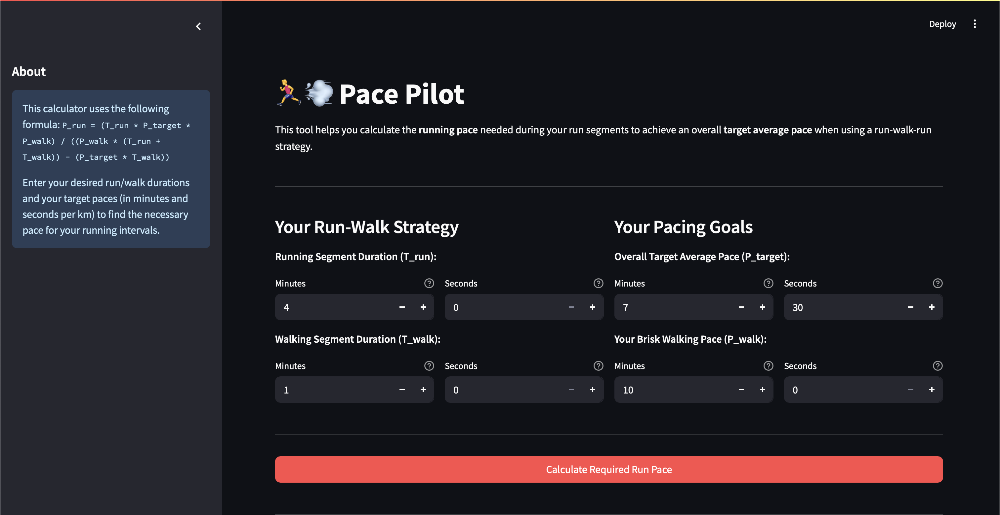

# 🏃‍♂️💨 Pace Pilot

Calculates the required running pace for a run-walk-run strategy based on your desired run/walk durations, overall target average pace, and typical brisk walking pace.



## ✨ Features & Usage

-   Calculates necessary running pace based on your run-walk strategy and overall target pace.
-   Inputs:
    -   Running segment duration (minutes/seconds)
    -   Walking segment duration (minutes/seconds)
    -   Overall target average pace (min/sec per km)
    -   Brisk walking pace (min/sec per km)
-   Displays required running pace (`M'SS"/km`) and cycle distance breakdown.
-   Includes input validations and warnings.

**Using the App:**

1.  Open the deployed Streamlit app.
2.  Enter your run/walk segment durations.
3.  Enter your overall target average pace and your brisk walking pace.
4.  Click "Calculate Required Run Pace" to view results.

## 🛠️ How to Run Locally

1.  **Prerequisites:** Python 3.7+, pip, `venv`.
2.  **Setup:**

    ```bash
    # Optional: Clone repo
    # git clone https://github.com/shreyas-londhe/pace-pilot.git
    # cd pace-pilot

    # Create and activate virtual environment
    # macOS/Linux:
    python3 -m venv venv
    source venv/bin/activate
    # Windows:
    # python -m venv venv
    # .\venv\Scripts\activate

    # Install dependencies
    pip install -r requirements.txt
    ```

3.  **Run:**
    ```bash
    streamlit run run_walk_calculator.py
    ```

## 🧪 Formula Used

`P_run = (T_run * P_target * P_walk) / ((P_walk * (T_run + T_walk)) - (P_target * T_walk))`

Where:

-   `T_run`: Running segment duration (min)
-   `T_walk`: Walking segment duration (min)
-   `P_target`: Overall target pace (min/km)
-   `P_walk`: Walking pace (min/km)

## ☁️ Deployment

Deployed via [Streamlit Community Cloud](https://share.streamlit.io/). Updates to the `main` branch trigger redeployment.

## 🤝 Contributing & Feedback

Suggestions, bug reports, and contributions are welcome (e.g., via GitHub Issues).

---

Happy Running!
